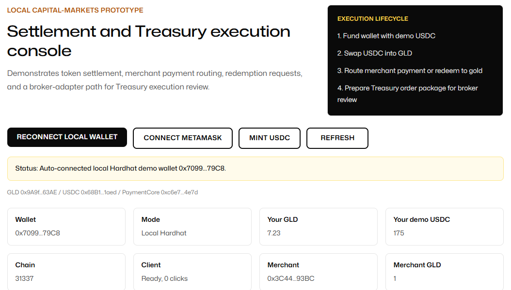
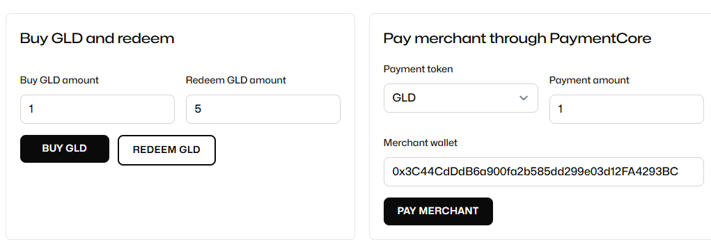
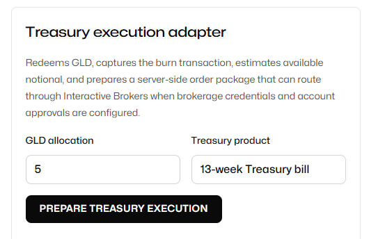

# Local Settlement Demo

Local EVM settlement prototype with a Next.js demo console. The app demonstrates a wallet funding flow, token purchase, merchant payment routing, redemption request, and a server-side Treasury execution package.

This repository is for local demonstration only. It is not configured for production trading, custody, brokerage, securities issuance, or consumer payments.

## Screenshots







## Repository Structure

```text
.
|-- contracts-main        # Hardhat / Solidity contracts and local deployment scripts
|-- landing-page-main     # Demo-only Next.js app
|-- docs/screenshots      # README screenshots
`-- start-local-demo.ps1  # Windows PowerShell local launcher
```

## Demo Flow

1. Start the local Hardhat chain and deploy the demo contracts.
2. Open the Next.js app at `/`.
3. Click **Use local demo wallet**.
4. Click **Mint USDC** to fund the local test wallet.
5. Click **Buy GLD** to approve demo USDC and swap into GLD.
6. Click **Pay merchant** to route a merchant payment through the payment core.
7. Click **Redeem GLD** or **Prepare Treasury execution** to exercise the redemption and broker-adapter paths.

## Quick Start

Prerequisites:

- Node.js 22 or newer
- npm
- Windows PowerShell for the root launcher
- Optional: MetaMask for injected-wallet testing on local chain `31337`

Install dependencies:

```powershell
cd .\contracts-main
npm ci --ignore-scripts

cd ..\landing-page-main
npm ci
```

Run the full local demo:

```powershell
cd E:\Sid\RickPatel\PhiGold\demo_code
.\start-local-demo.ps1
```

Then open:

```text
http://localhost:3000
```

## Manual Commands

Run the contracts stack:

```powershell
cd .\contracts-main
npm run node
npm run deploy:local
npm run demo:smoke
```

Run the frontend:

```powershell
cd .\landing-page-main
npm run dev -- -p 3000
```

## Treasury Execution Adapter

The Treasury workflow is implemented server-side in:

```text
landing-page-main/src/lib/demo/brokerExecutionAdapter.ts
```

By default, the route prepares an execution package and returns the operational details needed for broker review. Live broker order submission stays disabled unless all required brokerage environment variables are configured and order submission is explicitly enabled.

```text
TREASURY_EXECUTION_ADAPTER=ibkr
IBKR_ENABLE_ORDER_SUBMISSION=true
IBKR_BASE_URL=https://api.ibkr.com/v1/api
IBKR_ACCOUNT_ID=DU123456
IBKR_TREASURY_CONID=<instrument-conid>
IBKR_ACCESS_TOKEN=<server-side-access-token>
IBKR_ORDER_TYPE=MKT
IBKR_LIMIT_PRICE=<required-if-using-limit-orders>
IBKR_TIME_IN_FORCE=DAY
IBKR_TREASURY_QUANTITY=1
```

## Verification

Contract smoke test:

```powershell
cd .\contracts-main
npm run demo:smoke
```

Frontend production build:

```powershell
cd .\landing-page-main
npm run build
```

Current expected Next.js build routes:

```text
/                          static demo page
/_not-found                generic 404
/api/demo/treasury-orders  server-side Treasury adapter route
```

## Notes

- The frontend intentionally renders only the demo page at `/`.
- Local deployment addresses are written to `contracts-main/deployment-addresses-local.json` and `landing-page-main/src/lib/contracts/localDeployment.json`.
- The code uses local Hardhat accounts and demo tokens. Do not reuse this setup for live assets or customer transactions.
